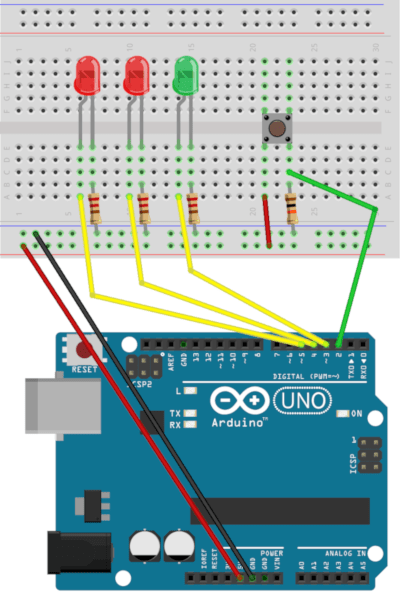

# Arduino Projects Book

Projects from the *Arduino Projects Book*
by Scott Fitzgerald and Michael Shiloh

## 1. Get to Know Your Tools

If I wanna do this I am going to need a desktop lamp with a magnifier glass, a digital copy of the book and maybe some extra tweezers.

... Done

## 2. Spaceship Interface

When the button is not pressed, the green LED is on and bot red LEDs are off. When the button is pressed, the green LED is off and the red LEDs will start to blink.

